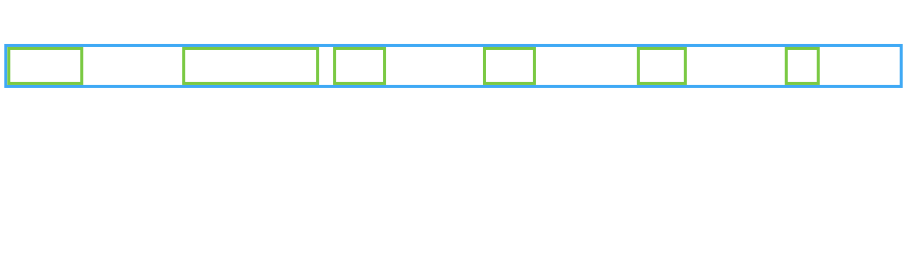

<!-- .slide: class="slide-title" data-background-image="img/surveying_leazerpark.jpg" data-background-repeat="no-repeat" data-background-opacity="0.25" data-background-color="#000000" data-background-position="center" -->

<link rel="stylesheet" href="pkg/fontawesome/css/all.css">

## CEG2722 
### [Linux Data Processing](https://www.ncl.ac.uk/undergraduate/degrees/module/?code=CEG2722)

<br>

<div style="font-size: 32px">

<i style="margin-left: 10px;" class="fa fa-envelope" aria-hidden="true"></i> achraf.koulali@ncl.ac.uk

*NCL | November, 2020*

</div>

<br>

<div class="container">

<div class="col-left">

<center>
School of Engineering
Geospatial
</center>

</div>

<div class="col-right">
<center>

</center>
</div>

</div>

---

### CEG2722 PART 2: OBJECTIVES

- To build on the foundations of scripting
<!-- .element: class="fragment" data-fragment-index="1" -->
<br><br>
- To prepare the skills and knowledge to manipulate data through scripts and programs for final-year projects etc.
<!-- .element: class="fragment" data-fragment-index="2" -->
<br><br>
- To introduce batch processing concepts and tools
<!-- .element: class="fragment" data-fragment-index="3" -->
<br><br>
- To develop subject-specific programming and scripting skills within current software and tools
<!-- .element: class="fragment" data-fragment-index="4" -->

---

### ACTIVITIES AND ASSESSMENT

* Four lectures (Monday/Wednesday week 1 and 2 ): 

* One assessed practical 50%)
	* Monday (week 1 and 2)
	* Wednesday (week 3 and 4)
	* <font color="yellow">Submission deadline</font>: **17th December 14:00pm**

---

### ACTIVITIES AND ASSESSMENT

<div class="heatMap" style="width:100%">

| Date | Activity |     |
| ---- | ---- | ---- |
| Monday, 23 Nov | Session 1 | Aidan/Practical 1 |
| Wednesday, 25 Nov | Session 2 |  |
| Monday, 30 Nov | Session 3 | Practical 2,3 |
| Wednesday, 2 Dec | Session 4 |  |
| Wednesday, 9 Dec | Practical 4,5 |  |
| Wednesday, 16 Dec | Practical 6,7 | Revision |

</div>

***Optional*** : Fridays afternoon 16:00pm Q/A session
---

### What is Linux ?

<div class="container">

<div class="col-left">

* Linux is an Operating System (OS) distributed under an open-source license.
<br>
* An OS is the software that directly manages a system's hardware and resources, like CPU, memory, and storage.

</div>

<div class="col-right">


</div>

</div>


---

### What does Linux include?

* <font color='orange'>Kernel</font>: The kernel manages the system's resources and communicates with the hardware.

* <font color='orange'>System user space</font>: The administrative layer for system level tasks (inclues <font color='yellow'>command line/shell</font>) 

* <font color='orange'>Applications</font>: A type of software that lets you perform a task (Desktop, Apps,...).

---

### Linux distributions

<div class="container">

<div class="col-left">

* Desktops/laptops with Linux do have nice graphical user
interfaces (KDE, Gnome, ...)

* HPC systems use the Linux command line

</div>

<div class="col-right">


</div>

</div>

---

### Why learn Linux?

* Free Software / Open Source

* Safe & Secure, Linux is renowned for its security.

* Efficient: modular, extensible software development;

---

### Why learn Linux?

* To process geospatial data on a High Performance Computing, you need to know how to use Linux.

* <font color="orange"> Why? </font>: Scriptable &#8594; the ability to automate tasks

---

### <font color="#84FC9B">Example</font>

You receive everyday 1,000 GPS data files, and you want to select only files that are within your region.

---


### Getting started

We will be using <font color="orange">**PuTTY**</font> for the examples and practicles :

[](https://www.chiark.greenend.org.uk/~sgtatham/putty/latest.html)

It's a free and open-source terminal emulator for Windows and Unix platforms.

<br>
<div id='dark_back'>
<div style="font-size: 30px">
Ceck the demonstration of practical 1 on how to use putty
</div>
</div>

---

### THE SHELL (command line interface)

* *Interprets* and *enacts* typed commands in real time some commands may run on other computers and/or at later time, or in background.


---

### THE SHELL (command line interface)

* Almost all Linux distributions provide the "Bourne again shell" (bash). There are many shell version such as: csh, tcsh, zsh...

* We will focus on <font color="cyan">bash</font>

shell prompt: <font color="yellow">user</font>@<font color="orange">machine</font>

---

### NAVIGATING THE FILESYSTEM:<font color="yellow">`cd`</font> AND <font color="yellow">`ls`</font>

The filesystem appears as a hierarchy of directories(folders):


---


* Use the command <font color="yellow">cd</font> (change directory):

```bash
# this is a comment
# change into dir
cd dir
# this command prints the the working directory
pwd 
```
<!-- .element: style="width: 100%" -->

* The command <font color="yellow">ls</font> to list the files in a directory.

```bash
ls       # lists the current directory
ls dir   # lists the directory dir
ls /home/user/Desktop/ # using the absolute path of a directory
```
<!-- .element: style="width: 100%" -->

---

### COMMAND LINE OPTIONS

* Linux commands may take one or more arguments.

* Traditionally, arguments beginning <font color="orange">"-"</font> or <font color="orange">"-\-"</font> are regarded as option flags.
```bash
ls --help 
# the option --help displays the help of the command ls
```
<!-- .element: style="width: 100%" -->
---

#### <font color="#84FC9B">Example 1</font>

* Login to Aidan using putty:

```bash
# This is a comment 
pwd # where am I
ls # what do I have
```
* How many folders are there?

```bash
cd ./Downloads
pwd
```
* what is the absolute path of the current directory?

---


### COMMAND LINE OPTIONS

* Traditionally, arguments beginning <font color="orange">"-"</font> or <font color="orange">"-\-"</font> are regarded as option flags affecting the behaviour of the command, e.g.

```bash
ls -ls # list in long format
ls -l  # list a single file in long format
ls -t  # list by modification time:  
ls -1  # list one file per line:  
ls --group-directories-first # list the subdirectories first
```

---

* Option flags may themselves take arguments

```bash
ls -w 25 # format to 25-char width
ls --width=25 # equivalently		
```


---

#### <font color="#84FC9B">Example 2</font>

```bash
ls -ls
```
<br>

<div style="font-size: 32px">
 output:
</div>

```console
total 20
4 drwxrwxr-x 2 user user 4096 Oct 17 09:18 Desktop
4 drwxrwxr-x 2 user user 4096 Oct 17 09:28 Documents
4 drwxrwxr-x 3 user user 4096 Oct 20 15:29 Downloads
0 -rw-rw-r-- 1 user user    0 Oct 17 10:07 morp2940.14o
0 -rw-rw-r-- 1 user user    0 Oct 17 10:07 morp294a.14n.Z
0 -rw-rw-r-- 1 user user    0 Oct 17 10:07 morp294a.14o
4 drwxrwxr-x 2 user user 4096 Oct 17 09:28 Music
4 drwxrwxr-x 2 user user 4096 Oct 17 09:28 Pictures
```

---

### WILDCARDS (PATTERNS)
Sometimes we want to specify just a few files
* <font color="yellow">"\*"</font> matches any group of characters (inc. null string)

```bash
ls *.mp3  # lists all the files with mp3 extension
```
<!-- .element: style="width: 100%" -->

---
### WILDCARDS (PATTERNS)

* <font color="yellow">"?"</font> matches exactly one character

```bash
ls text1.cs? # lists all files with one 
```
<!-- .element: style="width: 100%" -->

---
### WILDCARDS (PATTERNS)

* <font color="yellow">"[]"</font> matches exactly one of the chars (or range) in brackets

```bash
ls text[1-3].txt # lists text1.txt text2.txt text3.txt
ls text[abc].txt # lists texta.txt textb.txt textc.txt
```
<!-- .element: style="width: 100%" -->

---

#### <font color="#84FC9B">Example 3 (quiz)</font>
* Given the files:
```console
morp294z.14o morp2940.14o morp294a.14n.Z
```

* what does the following command mach? 
```console
morp???[0a-x].14[no]*
```

---

### BRACE EXPANSION

* Sometimes we want to specify a particular list.
```bash
ls -l test.{inp,out,err}
```
* We can also specify an alphabetical range
```bash
ls -l morp294{a..x}.14o
```
* For integer ranges we can also specify the increment
```bash
ls -l morp{01..365..7}0.14o 
ls -l morp{365..01..-7}0.14o
```

---

#### <font color="#84FC9B">Example 4 (quiz)</font>

<pre style="height: 500px"><code class="bash" data-trim data-noescape>
cd ~/ceg2722/examples/ex1/
ls
morp2940.14o    text10.txt  text1.txt  text3.txt  textc.txt
morp294a.14n.Z  text11.txt  text2.mp3  texta.txt
morp294a.14o    text1.csv   text2.txt  textb.txt

ls text2.{txt,mp3}
text2.mp3  text2.txt

ls text{a..c}.txt
texta.txt  textb.txt  textc.txt

ls text{1..3..1}.txt
text1.txt  text2.txt  text3.txt

ls text{1..3..2}.txt
?	
</code></pre>

---

### CREATE DIRECTORIES

* The <font color="yellow">"mkdir"</font> command is used to create directories. It works like this:

```bash
mkdir dir1 
mkdir di1 dir2 dir3
mkdir mymp3 netflix readings
```

---

### COPYING, MOVING AND DELETING FILES
* Copying files is done with <font color="yellow">"cp"</font>


```bash
# e.g. to copy text2.txt file to text_copy.txt
cp text2.txt text_copy.txt

# e.g. to copy text_copy.txt into the directory dir1
cp text_copy.txt dir1/

# e.g. to copy a directory dir1 to dir_copy
cp -r dir dir_copy

```

---

### COPYING, MOVING AND DELETING FILES
* Moving files with <font color="yellow">"mv"</font> has similar syntax

```bash
# e.g. to move (rename) the file text_copy.txt to text3.txt 
mv text_copy.txt text3.txt

# e.g. to move the file text3.txt inside the dir1 directory
mv text_move.txt ./dir1/
```

* Also deleting (removing) files with <font color="yellow">"rm"</font>

```bash
# e.g. to remove the file text2.txt
rm text2.txt 
```

---

### COPYING, MOVING AND DELETING FILES


* but directories can only be removed with (recursive) <font color="yellow">"rm -r"</font> which deletes all contents and subdirectories: <font color="magenta">BE VERY CAREFUL WITH THIS!</font>

```bash
# e.g. to remove the directory dir1
rm -r dir1
```

---

### DISPLAYING FILES:  <font color="yellow">`cat`</font>, `head` AND `tail`

* <font color="yellow">"cat"</font> displays the contents of a whole file (or several)

```bash
# e.g. to display the file text.txt
cat text1.txt 
This is line 1
This is line 2
This is line 3
This is line 4

# some useful options e.g. cat -n numbers each line
cat -n text1.txt 
     1	This is line 1
     2	This is line 2
     3	This is line 3
     4	This is line 4
```

---

### DISPLAYING FILES:  `cat`, <font color="yellow">`head`</font> AND `tail`

* <font color="yellow">head</font> displays the first few lines of a file (default 10)
* <font color="yellow">head -n</font> N shows the first N lines

```bash
# e.g. displays the first 5 lines of the file text.txt
head -n 4 text1.txt
```

---

### DISPLAYING FILES:  `cat`, `head` AND <font color="yellow">`tail`</font>

* <font color="yellow">tail</font> displays the last few lines of a file (default 10)

```bash
# e.g. displays the last 2 lines of the file text.txt
tail -n 2 text1.txt

```
* <font color="yellow">tail -f</font> keeps file open and displays text as it is added

---

### DISPLAYING FILES:  `cat`, `head` AND `tail`

* <font color="yellow">wc</font> counts lines, words and characters in files 

```bash
# e.g. counts the nuber of lines in the file
wc -l file
```

---

### DISPLAYING BIG FILES:  <font color="yellow">`more`</font> AND <font color="yellow">`less`</font>

* Using <font color="yellow">cat</font> on a large file is not very helpful, instead use <font color="yellow">more</font>:

```bash
# e.g.
more /usr/share/dict/words
```

---

### DISPLAYING BIG FILES:  <font color="yellow">`more`</font> AND <font color="yellow">`less`</font>

* <font color="yellow">less</font> is similar to <font color="yellow">more</font> (but better)

 | <!-- -->    | <!-- -->    |
 ------------------------- | ---------------
  can scroll backwards with | &#8593; keys 'u'
  scroll to beginning/end of file with | '<' or '>' 
 search forwards for a word with|'/word'
 quit gracefully|  'q' 


---

### SEARCHING FILES:  <font color="yellow">`egrep`</font>

* Suppose the "interesting" output only occurs on certain lines within a large file

<pre style="height: 100px; width: 1100px;"><code class="bash" data-trim data-noescape>
# e.g. extract the line containing "SATBIAS" in the file tdpfile
egrep SATBIAS tdpfile

# e.g. similar to the previous, the flag -i refers to case insensitive pattern
egrep -i satbias tdpfile 
</code>
</pre>

---

### SEARCHING FILES:  <font color="yellow">`egrep`</font>

* We can also search for lines <font color="orange">NOT</font> containing a tag, with -v option

```bash
# e.g. 
egrep -i -v satbias tdpfile
```
<!-- .element: style="width: 100%" -->

---

#### <font color="#84FC9B">Example 5</font>

* The file ```"IGSNetwork.csv"``` contains information about all the IGS global GNSS network.

```bash
cd ~/ceg2722/examples/ex2/
ls
```

<div style="font-size: 30px;text-align: left;">
1. Check if the station MORP is an IGS station.<br>
2. If yes, what is the corresponding line number of the record in the file? <br>
3. How many IGS stations are located in the United Kingom?<br>
</div>

---

### EDITING FILES:  micro

We can edit files using the micro text editor.


```bash
# opens an editing window
micro IGSNetwork.csv  
```


---

### SUMMARY

* Accessing Linux at Newcastle
<!-- .element: class="fragment" data-fragment-index="1" -->
* Basic filesystem navigation
<!-- .element: class="fragment" data-fragment-index="2" -->
* Filename pattern wildcards and brace expansion
<!-- .element: class="fragment" data-fragment-index="3" -->
* Displaying and searching file contents
<!-- .element: class="fragment" data-fragment-index="4" -->

---
<!-- .slide: class="slide-title" data-background-image="img/prac_back.jpeg" data-background-repeat="no-repeat" data-background-opacity="0.25" data-background-color="#000000" data-background-position="center" -->

## CEG2722

### [Linux Data Processing](https://www.ncl.ac.uk/undergraduate/degrees/module/?code=CEG2722)

#### Practical - part 1

---
<!-- .slide: class="slide-title" data-background-image="img/surveying_leazerpark.jpg" data-background-repeat="no-repeat" data-background-opacity="0.25" data-background-color="#000000" data-background-position="center" -->

## CEG2722

### [Linux Data Processing](https://www.ncl.ac.uk/undergraduate/degrees/module/?code=CEG2722)

#### Session 2

---

### REDIRECTING INPUT AND OUTPUT (1)
* Output can be sent to a file with <font color="yellow">">"</font> or <font color="yellow">">>"</font>

```bash
# e.g starts a new file
cat file1 file2 > all.txt 
# e.g. appends to the file
cat file3 >> all.txt      
```

* Input can be taken from a single file

```bash
# does same as (2) above
cat < file3 >> all.txt 
```

---

### REDIRECTING INPUT AND OUTPUT (2)
* By convention, file <font color="yellow">"-"</font> refers to the standard input

```bash
# e.g. does same as (3) above
cat - > notes.txt 

# inserts the text from stdin (keyboard) between file1 and file2
cat file1 - file2 > all2.txt
```
<!-- .element: style="width: 100%" -->

---

### STANDARD OUTPUT & STANDARD ERROR
* Most commands actually issue two sorts of output
	* <font color="orange">standard output</font> i.e. the normal results of the command
	* <font color="pink">standard error</font> i.e. messages about problems
		* <font color="yellow">">"</font> by itself just redirects stdout
		* <font color="yellow">">&"</font> redirects both stdout and stderr to the same file

* stdout and stderr can be directed separately:
```bash
cmd >cmd.out 2>cmd.err
# the '2' immediately before the '>' refers to the stderr
```
<!-- .element: style="width: 100%" -->

---

#### <font color="#84FC9B">Example 6</font>

* Concatenate the <font color="cyan">first 5 lines</font> and the <font color="cyan">last 2 lines</font> of the file 	`IGSNetwork.csv`, then redirect the result into a new file `newfile.txt`


---

#### <font color="#84FC9B">Example 6</font>

* Concatenate the <font color="cyan">first 5 lines</font> and the <font color="cyan">last 2 lines</font> of the file `IGSNetwork.csv`, then redirect the result into a new file `newfile.txt`


```bash
# the first step
head -n 5 IGSNetwork.csv > newfile.txt

# second step : note that I'm using >> here to append the result
tail -n 2 IGSNetwork.csv >> newfile.txt

# now print the result
cat newfile.txt

# quiz
what is the output of cat newfile - > newfile_modified.txt
```
<!-- .element: style="width: 100%" -->

---

### <font color="yellow">`cut`</font>

* <font color="yellow">cut</font> extracts column(s) from a file

```bash
# e.g. extracts column 2 (tab-delimited)
cut -f2 file1

# e.g. extracts col 3 to end of each line
cut -f3- file2 

# e.g. extracts chars 9-20 (beware tabs or use expand!)
cut -c9-20 

# e.g extracts col 1, comma-delimited
cut -f1 -d, file3 
```

<div id='dark_back'>

<font color="magenta">beaware:</font> lines without delimiters are **ALWAYS** output, unless -s option is used 
```console 
e.g. cut -f1 -d, -s file3 
```
</div>

---

### <font color="yellow">`paste`</font>

* <font color="yellow">paste</font> merges files line by line, tab-separated
	* <font color="magenta">beaware:</font> if files are different length, so maybe first use …

	* <font color="#84FC9B">Example</font>

```bash
paste file1.txt file2.txt
```

---

### PIPELINES AND FILTERS
* Naively we might have done something like this

```bash
# the command expand here converts tabs to spaces
expand datafile > temp1

cut -c9-20 temp1 > temp2

paste timetags temp2 > outfile
```

* The above creates unnecessary files, so instead we can use piplies <font color="yellow">"|"</font>

```bash
expand datafile | cut -c9-20 | paste timetags - >outfile
```
<div class="bottom-left" style="font-size: 30px";>

In a pipeline, the standard output of the preceding command is fed to the standard input of the following one;

</div>

---

#### <font color="#84FC9B">Example 7</font>

* Extract the site names and the Receivers columns from `IGSNetwork.csv`, paste and redirect to a new file:


---

#### <font color="#84FC9B">Example 7</font>

* Extract the site names and the Receivers columns from `IGSNetwork.csv`, paste and redirect to a new file:

```bash
# first: lets get the receivers which are in column 10
cut -f1 -d, IGSNetwork.csv > sites.txt
# now we use paste with a pipline to get the result
cut -f10 -d, IGSNetwork.csv | paste sites.txt - > newfile.txt

```

---

### ADVANCED SEARCHING WITH <font color="yellow">`egrep`</font>

* Lines containing one of a list of tags

```bash
egrep -f tagfile tdpfile
egrep 'TROP|TRP' tdpfile
```

* Sometimes we get more results than we wanted!

```bash
egrep gullible /usr/share/dict/words
```

---

### ADVANCED SEARCHING WITH <font color="yellow">`egrep`</font>

* How to avoid matching parts of words?

```bash
# e.g. matches at start of line only
egrep ^back /usr/share/dict/words 

# e.g. matches at end of line only
egrep back$ /usr/share/dict/words 

# e.g. matches whole of line only
egrep ^back$ /usr/share/dict/words

# maches the whole word
egrep -w back /usr/share/dict/words 
```

---

### MULTIPLE <font color="yellow">`egrep`</font> FILTERS

* Useful when we want to combine two or more tests
```bash
# e.g. 
egrep -w all /usr/share/dict/words | egrep -v ^all | egrep -v all$
# e.g. search for the word REC(EIVER) and print if not a TRIMBLE
egrep -w REC morp*.??o | egrep -v TRIMBLE
```
<!-- .element: style="width: 100%" -->

* Also when we combine with before/after context lines to find patterns that occur on nearby lines
```bash
# e.g. 
egrep -A 1 tag1 inpfile | egrep -v tag1 | egrep tag2
```
<!-- .element: style="width: 100%" -->

---

#### <font color="#84FC9B">Example 8</font>

* I want to search for all the GPS sites with a receiver model TRIMBLE, then look for those locate in the UK (lines ending with "00GBR")


---

#### <font color="#84FC9B">Example 8</font>

* I want to search for all the GPS sites with a receiver model TRIMBLE, then look for those locate in the UK (lines ending with "00GBR")

```bash
egrep TRIMBLE IGSNetwork.csv | egrep 00GBR$
```

---

### SEARCH AND REPLACE:  <font color="yellow">`sed`</font>
* We can modify the input in many ways with <font color="yellow">sed</font>, but the most useful is

```bash
sed s/pattern/replacement/ inpfile >outfile 
# lines not containing the pattern are output just as they were
```
<!-- .element: style="width: 100%" -->

* This is useful for generating an input file from a template

<pre style="height: 100px; width: 950px;"><code class="bash" data-trim data-noescape>
sed s/DOY/046/ template.inp >myinput.inp
sed s/YY/13/ template.inp | sed s/DOY/046/ | sed s/SITE/morp/ >myinput.inp
</code>
</pre>

---

### SEARCH AND REPLACE:  <font color="yellow">`sed`</font>
* To make multiple replacements on a line, use 

```bash
sed s/pattern/replacement/g inpfile >outfile 
```

---

### VARIABLES

* There are a few ways in which variables may be set *(such as part of the execution of a command)* but the basic form follows this pattern:

```bash
# assign value to variable
variable=value
```

* To use the variable we then place its name preceded by a $ sign.

```bash
# e.g variable
var=2
# print the variable
echo $var
```

---

### USING <font color="yellow">`for`</font> LOOPS TO GENERATE INPUT

* The basic syntax of a for loop is

```bash
# One liner
for i in wordlist; do command; done
```

<br>

```bash
# script style / more readable format
for i in wordlist
do 
	command
done
```

---

#### <font color="#84FC9B">Example 9</font>

* Several ways to generate "wordlist"; the simplest way to generate a fixed list uses brace expansion

<pre style="height: 100px; width: 1000px;"><code class="bash" data-trim data-noescape>
# e.g. setup a series of input files for each day of the year
for doy in {001..365}; do sed s/DOY/$doy/g template.inp >doy${doy}.inp; done
	
# e.g. setup a list of commands to run sh_processyear on each year 
for year in {1994..2014}; do echo "sh_processyear $year" >>sh_runyears; done
</code>
</pre>

---

### COMPOUND COMMANDS

* A compound command is just a series of instructions separated by semicolons
may be placed: 

 * in braces <font color="orange"> { cmd1; cmd2; }</font> for clarity, 
 * or in parentheses <font color="orange">(cmd1; cmd2)</font> to isolate in a subshell commands are executed sequentially regardless of errors, e.g:

```bash
for doy in {001..365}; 
do { 
   echo "Processing day of year $doy";
   sed s/DOY/$doy/g template.inp >doy${doy}.inp;
   (sh_processday ${doy}.inp) >/dev/null;
}
done
```

---

### USING <font color="yellow">`for`</font> LOOPS TO PROCESS MANY FILES

* Instead of brace expansion, we can use pattern expansion just to work on the files that are present;

	* <font color="#84FC9B">Example:</font> 
		* Check antenna type for MORP GPS data

```bash
for file in morp*.??o; do 
	egrep 'ANT' $file | egrep AOAD/M_T >/dev/null && echo $file OK
	|| echo $file bad: && egrep 'ANT ' $file
done
```
<!-- .element: style="width: 100%" -->

---

### USING <font color="yellow">`for`</font> LOOPS TO PROCESS MANY FILES

* Or we can take the wordlist from a file, e.g.

```bash
for file in `cat filelist.txt`
do 
	egrep ANTENNA $file;
done
```

---

#### <font color="#84FC9B">Example 10</font>

* Which day of the site "MORP" GPS data files has the wrong antenna?

```bash
cd ~/ceg2722/examples/ex3

# now your turn to complete the for loop
for file in ...
	...
done
```

---

### SUMMARY

* Pipelines link output and input between operations
<!-- .element: class="fragment" data-fragment-index="1" -->
* Extracting, searching and replacing text
<!-- .element: class="fragment" data-fragment-index="2" -->
* Using for loops on multiple files or test cases Compound commands
<!-- .element: class="fragment" data-fragment-index="3" -->

---
<!-- .slide: class="slide-title" data-background-image="img/prac_back.jpeg" data-background-repeat="no-repeat" data-background-opacity="0.25" data-background-color="#000000" data-background-position="center" -->

## CEG2722

### [Linux Data Processing](https://www.ncl.ac.uk/undergraduate/degrees/module/?code=CEG2722)

#### Practical - parts 2,3


---
<!-- .slide: class="slide-title" data-background-image="img/surveying_leazerpark.jpg" data-background-repeat="no-repeat" data-background-opacity="0.25" data-background-color="#000000" data-background-position="center" -->

## CEG2722

### [Linux Data Processing](https://www.ncl.ac.uk/undergraduate/degrees/module/?code=CEG2722)

#### Session 3

---

### `bash` SHELL SCRIPTING AND BASIC <font color="yellow">`awk`</font>

* Session 3
	* <font color="cyan">Scripts</font>
		* More on shell variables
		* Conditional expressions and statements
		* Functions

	* <font color="yellow">awk</font> a multi-purpose filter
		* Simple reformatting with awk

---

### `bash` SCRIPTS

* A script is just a series of commands placed in a file and executed this way

	* execute within the current shell with e.g.
```console
./myscript.sh
```
	* execute within a subshell 
```console
bash myscript.sh
```

---

#### <font color="#84FC9B">Example 11</font>

<div class="container">
<div class="col-left">

* Demonstration of script:
</div>

<div class="col-right">

```bash
#!/bin/bash
echo "Hello world"

```

</div>
</div>

<br>
<br>
log to your account and follow the steps


---

### WHY SCRIPT?

* <font color="orange">Automate</font> a series of commands 
	* shell can call any other command-line program 
	* consistent processing (or re-processing) of data
	* create families of similar datasets/visualisations

* <font color="orange">Document</font> what processing has been done (usage of comments)

* <font color="orange">Share</font> tools and techniques

---

### SETTING AND MODIFYING SHELL VARIABLES

* Variables may be set as positional parameters (arguments)

```bash
x=1 # or 
file=morp2010.11o
```

* We can display a variable using <font color="yellow">echo</font>

```bash
# e.g.
echo $file
```

---

#### <font color="#84FC9B">Example 12</font>
* When referencing their values, e.g. ```$file``` or ```${file}```, we may want to modify the output result

```bash
file=morp2010.11o
# morp2010 (skip 0 chars then output 8)
${file:0:8} 
# 11o skip back 3 chars from end, then output to end of string
# N.B. compulsory space between : and -
${file: -3} 
# 12 (the length of the string)
${#file} 
# morp2010. (remove a trailing pattern)
${file%??o}
# 2010.11o (remove a leading pattern)
${file#morp} 

```
<!-- .element: style="width: 100%" -->

---

### ARITHMETIC EXPANSION

* An integer arithmetic expression involving variables can be evaluated using <font color="yellow">```$((expression))```</font> 
usual arithmetic operators and precedence apply (** is exponent)

```bash
a = 1
b = 2
c = $((a+b))
echo $c
```

---

### ARITHMETIC EXPANSION

* division <font color="orange">/</font> and remainder <font color="orange">%</font> truncate quotient towards zero
	* conditional and logical operators also available
 	* <font color="orange">$</font> in front of variable names (and surrounding <font color="orange">{}</font>) are not required in expression 

<div id="dark_back">
<font color="magenta">beware</font>: values/constants with leading zero e.g. 078 are interpreted as octal, not decimal
</div>

---

#### <font color="#84FC9B">Example 13</font>

```bash
a=3
b=4 
c=-5
d=012
# what are the outputs of the following expressions?
$((c/a))   
$((c%a))  
$(((a+b)*c))  
$((a>2))  
$((b*d))
```

---

### RECAP:  FILTERS

* Most operations can be considered as filters (or pipelines of filters) acting on input data streams
```bash
# e.g.  
teqc +qcq +quiet morp3420.07o | egrep SUM | cut -c59-61
```

* Typical filters do something very specific (e.g. teqc), or fairly limited in scope (e.g. <font color="yellow">cut</font>)

---

#### <font color="#84FC9B">Example 14</font>

* teqc (pronouced "tek") is designed to pre-process GNSS data with a command line interface (<font color="yellow">`teqc`</font>).

<pre style="height: 100px; width: 1100px;"><code class="bash" data-trim data-noescape>
cd ~/ceg2722/examples/ex3

# now modify the command line from the 
# previous slide to get the number of complete observations
...

</code>
</pre>

---

#### <font color="#84FC9B">Example 14</font>

* teqc (pronouced "tek") is designed to pre-process GNSS data with a command line interface (<font color="yellow">`teqc`</font>).

<pre style="height: 100px; width: 1100px;"><code class="bash" data-trim data-noescape>
cd ~/ceg2722/examples/ex3
./teqc +qcq +quiet morp0030.14o | egrep "Complete observations" | cut -c28-32

</code>
</pre>

---

### BASIC <font color="yellow">`awk`</font> SYNTAX:  PATTERN-ACTION

* <font color="yellow">awk</font> is an advanced filter allowing a wide variety of operations on its input
	* the GNU implementation is <font color="yellow">`gawk`</font>

* The generic structure of an awk script is:
```console
condition1  {action1}
condition2  {action2}
…
```

---

### BASIC <font color="yellow">`awk`</font> SYNTAX:  PATTERN-ACTION

* Many scripts just consist of a single pattern-action pair, so they are specified on the command line, e.g.
```bash
awk '/WETZTROP/ {print}' tdpfile
```

* The default action is to print the entire record, so this is equivalent to
```bash
awk '/WETZTROP/' tdpfile
```

---

### BASIC <font color="yellow">`awk`</font> SYNTAX:  PATTERN-ACTION

* Similarly the default condition is to match every line, so we might do
<pre style="height: 75px; width: 900px;"><code class="bash" data-trim data-noescape>
# which will print every record preceded by its number
awk '{print NR,$0}' file 
</code>
</pre>

---

### <font color="cyan">RECORDS</font> AND <font color="lightgreen">FIELDS</font>



---

### RECORDS AND FIELDS

* <font color="yellow">awk</font> splits its input into records (by default lines) 

	* variables <font color="cyan">FNR</font> and <font color="cyan">NR</font> automatically count the number of records read from the current file and in total respectively

```bash
# e.g. this will print the first line (record)
awk 'NR==1{print $0}' filename
```

---

### RECORDS AND FIELDS

* Each record is then split into fields
	* variable <font color="lightgreen">NF</font> is automatically set to the number of fields
	* values of each field are given by `$1`,`$2`, … `$NF` (`$0` is the full record)

<pre style="height: 100px; width: 1070px;"><code class="bash" data-trim data-noescape>
# e.g. this will print columns 1,3 and 4 if the fifth field equals to "WETZTROPNSLG"
awk '$5=="WETZTROPNSLG" {print $1,$3,$4}' tdpfile    

# e.g. you can use substr inside awk to select a sub-string
awk 'substr($0,75,12)=="STA X   NSLG" {print $1,1000*$3,1000*$4}' tdpfile 
</code>
</pre>

---

### FORMATTED OUTPUT WITH <font color="yellow">`printf`</font>

* Generic syntax is <font color="yellow">`printf`</font>(***format***,***arguments***) format is a string describing how to print arguments 

<pre style="height: 100px; width: 900px;"><code class="bash" data-trim data-noescape>
# prints $1 as a decimal integer, $2 as a floating-point number, and 
printf("%d %f %s\n",$1,$2,$3)
</code>
</pre>

<font color="#84FC9B">Example</font>

```bash
# the input file looks like : 2010 2.5 NCL
awk '{printf("%d %f %s\n",$1,$2,$3) }' filename

# $3 as a string, all separated by spaces, followed by a newline
```
<!-- .element: style="width: 100%" -->

---

### FORMATTED OUTPUT WITH <font color="yellow">`printf`</font>

* Optional fieldwidth  between the <font color="orange">%</font> and the type specifier

```bash
awk '{printf("%10.4f\n",$1)}' filename
```
<div id='dark_back' style="font-size: 30px";>
This command prints `$1` using 10 characters, with 4 digits after the decimal point
output is right-justified, unless fieldwidth < 0
</div>

---

#### <font color="#84FC9B">Example 15</font>

<pre style="height: 100px; width: 950px;"><code class="bash" data-trim data-noescape>
cd ~/ceg2722/examples/ex2/

# print the content of the dcb.dat file if the first coloumn is GPS ("G")

</code>
</pre>

---

#### <font color="#84FC9B">Example 15</font>

<pre style="height: 100px; width: 950px;"><code class="bash" data-trim data-noescape>
cd ~/ceg2722/examples/ex2/

# print the content of the dcb.dat file if the first coloumn is GPS ("G")
awk '$1=="G"{print $0}' dcb.dat
</code>
</pre>

---


### <font color="yellow">BEGIN</font> AND END CONDITIONS 

* The <font color="yellow">BEGIN</font> condition is met before any lines of input are read 

	* if the script only has a <font color="yellow">BEGIN</font> condition, no input is read

	* variables are not passed to the script until after the <font color="yellow">BEGIN</font> action, unless the <font color="magenta">-v</font> syntax is used
```bash
# e.g. we pass the variable test=1
awk -v test=1 'BEGIN {print test*2}' 
```

---

### BEGIN AND <font color="yellow">END</font> CONDITIONS

* The <font color="yellow">END</font> condition is met once all input is read
can be used to output results, e.g.

```bash
awk '$1!="#" {sum+=$1}  END {print sum}'
# or 
awk '$1!="#" {sum+=$1; N++}  END {print sum/N}'
```

---

#### <font color="#84FC9B">Example 16</font>

* calculate the average of the forth column in the file *eur16807.res*

```bash
cd ~/ceg2722/examples/ex5/
# run your command
...
```

---

#### <font color="#84FC9B">Example 16</font>

* calculate the average of the forth column in the file *eur16807.res*

```bash
cd ~/ceg2722/examples/ex5/
# solution
awk '$1!="#" {sum+=$4; N++}  END {print sum/N}' eur16807.res
```

---

### EXPRESSIONS AND BUILT-IN FUNCTIONS

* Logical expressions <font color="cyan">&&</font> (AND); <font color="cyan">||</font> (OR); <font color="cyan">!</font>(NOT)

* Arithmetic expressions and built-in functions
| sign     | operation |
|--------- |-----------|
|  + - *   | ususal    |
| ** or ^  | power     |
| %        | remainder |

|           |           |           |             |           |           |           |
|-----------|-----------|-----------|-------------|-----------|-----------|-----------|
|  int(x)   | sqrt(x)   |  sin(x)   | atan2(y,x)  | log(x)    | exp(x)    | rand      |

---

### PASSING VARIABLES TO <font color="yellow">`awk`</font>

* Sometimes we need to specify a parameter for awk from the shell

<pre style="height: 100px; width: 1000px;"><code class="bash" data-trim data-noescape>
# we can do this, including setting RS or FS, with e.g.
awk '{print tag,NF}' RS=',' tag='#' inpfile
# we can even reset variables between one input file and the next, e.g.
awk '{print tag,NF}' RS=',' tag='#' inpfile1 RS=';' inpfile2
</code></pre>

* This can be used to set reference values for data analysis, e.g.

<pre style="height: 100px; width: 1000px;"><code class="bash" data-trim data-noescape>
for doy in {001..365}; do
  awk '{print $1+86400*(doy-1),$2,$3,$4}' doy="$doy" morp${doy}0.txyz; 
done 
</code>
</pre>

---

### SUMMARY

* Scripts allow us to group repeatable sequences of powerful commands
<!-- .element: class="fragment" data-fragment-index="1" -->
* Parameter manipulation and arithmetic
<!-- .element: class="fragment" data-fragment-index="2" -->
* Reformatting text with awk, and basic calculations
<!-- .element: class="fragment" data-fragment-index="3" -->
* For more detail, try e.g.
<!-- .element: class="fragment" data-fragment-index="4" -->

[http://software-carpentry.org/](http://software-carpentry.org/)
[http://mywiki.wooledge.org/BashGuide](http://mywiki.wooledge.org/BashGuide)
<!-- .element: class="fragment" data-fragment-index="5" -->

---

<!-- .slide: class="slide-title" data-background-image="img/prac_back.jpeg" data-background-repeat="no-repeat" data-background-opacity="0.25" data-background-color="#000000" data-background-position="center" -->

## CEG2722

### [Linux Data Processing](https://www.ncl.ac.uk/undergraduate/degrees/module/?code=CEG2722)

#### Practical - part 4


---
<!-- .slide: class="slide-title" data-background-image="img/surveying_leazerpark.jpg" data-background-repeat="no-repeat" data-background-opacity="0.25" data-background-color="#000000" data-background-position="center" -->

## CEG2722

### [Linux Data Processing](https://www.ncl.ac.uk/undergraduate/degrees/module/?code=CEG2722)

#### Session 4

---

### ROBUST SCRIPTING WITH `bash`

* Command lists and other conditional syntaxes
<!-- .element: class="fragment" data-fragment-index="1" -->
* More flexible looping commands
<!-- .element: class="fragment" data-fragment-index="2" -->
* More advanced search/replace
<!-- .element: class="fragment" data-fragment-index="3" -->
* Other useful commands and syntax
<!-- .element: class="fragment" data-fragment-index="4" -->

---

### COMMAND LISTS

* A command list is a series of instructions separated by the logical operators <font color="yellow">`&&`</font> and/or <font color="yellow">`||`</font>

*  <font color="yellow">`&&`</font> means that the command is executed only if the previous one **"<font color="magenta">succeeds</font>"**; likewise <font color="yellow">`||`</font> if it 'fails'

* <font color="#84FC9B">Example</font>
```bash
ls morp* >/dev/null && echo "got a morp file"
```

---

### CONDITIONAL EXPRESSIONS

* <font color="cyan">[[</font> <font color="magenta">test</font> <font color="cyan">]]</font> considers test and returns <font color="cyan">0(false)</font> or <font color="cyan">1(true)</font>
	* N.B. spacing after [[ and before ]] 

* <font color="#84FC9B">Example:</font> [[ -e file ]] true if file exists

```bash
for file in morp*.??o; 
   do [[ -s $file ]] && teqc +qcq +quiet $file >> ${file%??o}teqc; 
done 

```
<!-- .element: style="width: 100%" -->

---

* Many of the tests in [[ ]] work on files

```bash
# true if file exists
 [[ -e file ]] 

# true if regular file
 [[ -f file ]] 

# true if a directory
 [[ -d file ]] 

# true if size >0
 [[ -s file ]] 
```

---

###  <font color="yellow">`if`</font> STATEMENTS in Bash

* With <font color="yellow">if</font> you can perform different actions based on a condition. 

* <font color="#84FC9B">Example</font>

```bash
i=2

if [ $i -eq 2 ]; then
	echo 'value is equal to 2'
else
	echo 'value is different from 2'
fi
```

---

#### <font color="#84FC9B">Example 17</font>

* Lets run the following script (myscript1.sh)

```bash
#!/bin/bash
# my script for step 1
for file in morp*.??o;
   do teqc +qcq +quiet $file >> ${file%??o}teqc; 
done 
```

---

#### <font color="#84FC9B">Example 18</font>

* Now we try this version (myscript2.sh)

```bash
#!/bin/bash
# myscript for step2
for file in morp*.??o; do
	do [[ -s $file ]] && teqc +qcq +quiet $file >> ${file%??o}teqc; 
done
```
<!-- .element: style="width: 100%" -->
<br>

What is the difference between the two versions (in Ex. 17 and 18)?

---

### ARRAY VARIABLES

* Similar to lists in python

```bash
#
a=(apple banana kiwi pear)  
echo $a
# result : apple banana kiwi pear
echo $a[2]
# result: banana
```

---

### ARRAY VARIABLES

* useful for generating a list of files to iterate over;

<font color="#84FC9B">Example</font>

```bash
files=(`ls morp*`)
for i in ${!files[@]}; do
	teqc +qcq +quiet ${files[i]} > ${files[i]%09o}teqc; 
done
```

---

### <font color="yellow">`while`</font> AND <font color="yellow">`until`</font> LOOPS

* <font color="yellow">while</font> iterates as long as a status is <font color="magenta">true</font>:
```bash
while testcmd; do
	cmd; 
done
```

* <font color="yellow">until</font> iterates as long as a status is <font color="magenta">false</font>:
```bash
until testcmd; do
	cmd; 
done
```

---

### <font color="yellow">`while`</font> AND <font color="yellow">`until`</font> LOOPS

* <font color="#84FC9B">Example</font>

```bash
#!/bin/bash
# set day to 1
day=1

# continue until $n equals 5
while [[ $day -le 5 ]]; do
	echo "Processing $day"
	filename=morp_2019_${day}.dat
	day=$(( day+1 ))	 # increments $n
done
```


---

### <font color="yellow">`break`</font> AND <font color="yellow">`continue`</font>

* <font color="magenta">continue</font> will resume the enclosing `for`, `while` or `until` loop at the start of the next iteration.

<font color="#84FC9B">Example</font>

```bash
files=(`ls morp*`)
for i in ${!files[@]}; do
	if [[ -e $file ]];then 
		break
	fi
	teqc +qcq +quiet ${files[i]} > ${files[i]%09o}teqc; 
done
```

---

### OTHER USEFUL COMMANDS

<font color="yellow">find</font> recursively looks for files with specific attributes

```bash
# search file with name ending 15o
find . -name '*.15o'

# size > 100MB
find . -size +100M -ls

# modified in last <10 mins
find . -mmin -10 

find . -maxdepth 2 -name 'sh_*' -ls

```

---

### SUMMARY

* Use of for loops for multiple files
<!-- .element: class="fragment" data-fragment-index="1" -->
* Use of conditional expressions and if statements
<!-- .element: class="fragment" data-fragment-index="2" -->
* Use of while and until loops
<!-- .element: class="fragment" data-fragment-index="3" -->

---

### SUMMARY CEG2722

* Make each program/script do <font color="yellow">one</font> thing <font color="magenta">well</font>
<!-- .element: class="fragment" data-fragment-index="1" -->

* Document your script by adding <font color="yellow">comments</font> at each step
<!-- .element: class="fragment" data-fragment-index="2" -->

* Use <font color="yellow">wildcards</font> and/or <font color="yellow">`for`</font> loops to work with multiple files 
<!-- .element: class="fragment" data-fragment-index="3" -->

* <font color="yellow">awk</font> allows very flexible reformatting and summary computations on output files / datasets
<!-- .element: class="fragment" data-fragment-index="4" -->

* <font color="pink">try it yoursef...</font>
<!-- .element: class="fragment" data-fragment-index="5" -->

---


<!-- CONTACT -->
<!-- ====================================================================== -->

### Contact

<ul class="fa-ul" style="">

<i style="margin-left: 10px;" class="fa fa-envelope" aria-hidden="true"></i>  [achraf.koulali@newcastle.ac.uk](mailto:achraf.koulali@newcastle.ac.uk)
<br>
<br>
<i style="margin-left: 10px;" class="fa fa-building" aria-hidden="true"></i>  [Cassie G.15](https://www.ncl.ac.uk/engineering/staff/profile/achrafkoulali.html#background)


</ul>

---

<!-- LICENSE -->
<!-- ====================================================================== -->

<!-- .slide: class="slide-license" -->

<p class="license-icons">
<i class="fab fa-creative-commons"></i><i class="fab fa-creative-commons-by"></i>
</p>

This presentation is licensed under a

[Creative Commons Attribution 4.0 International License](https://creativecommons.org/licenses/by/4.0/).


<style>
.container{
display: flex;
}
.col-right{
   	margin: 10px 0 15px 0;
	float: right;
	text-align: left;
	z-index:-10;
	width:50%;
	font-size: 0.85em;
	line-height: 1.5;
}
.col-left{
	margin: 10px 0 15px 20px;
	text-align: left;
	float: left;
	z-index:-10;
	width:48%;
	font-size: 0.85em;
	line-height: 1.5; 
}

#dark_back {
	background-color: rgba(0, 0, 0, 0.9);
	color: #fff;
	padding: 20px;
}

.pre {
    width: 100%;
    margin: 0;
    box-shadow: 5px 5px 10px rgba(0, 0, 0, 0.8);
    code {
        padding: 3%;
        max-height: none;
        font-size: @basefontsize * 0.5;
    }
}

.reveal {
  font-family: sans-serif;
  font-size: 38px;
  font-weight: normal;
}

.heatMap {
    width: 70%;
    text-align: center;
}
.heatMap th {
background: grey;
word-wrap: break-word;
text-align: center;
}
.heatMap tr:nth-child(1) { background: #0D3D56; }
.heatMap tr:nth-child(2) { background: #107856; }
.heatMap tr:nth-child(3) { background: #0D3D56; }
.heatMap tr:nth-child(4) { background: #107856; }
.heatMap tr:nth-child(5) { background: #107856; }
.heatMap tr:nth-child(6) { background: #107856; }

</style>
